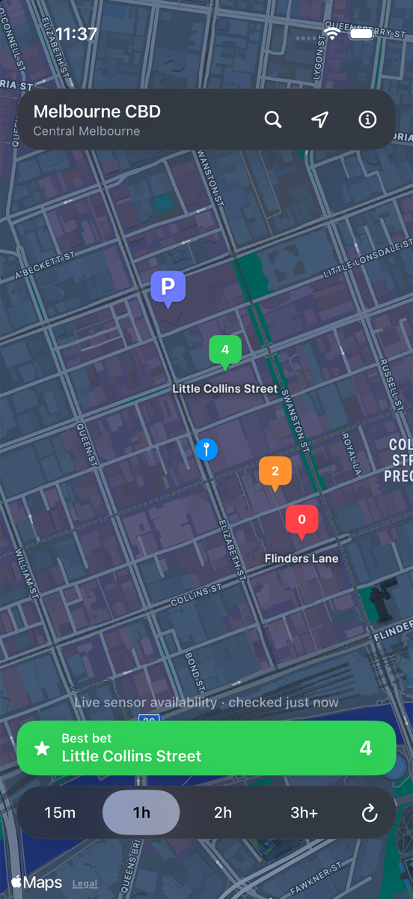
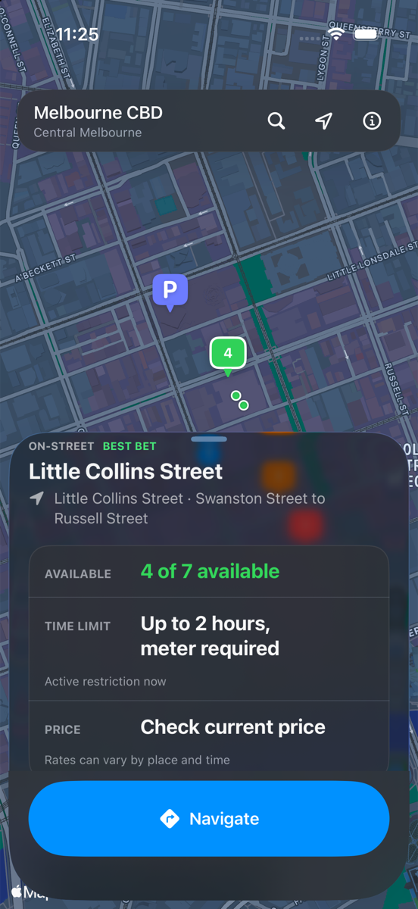
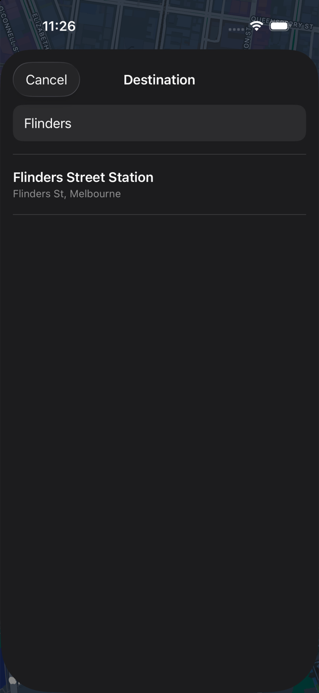
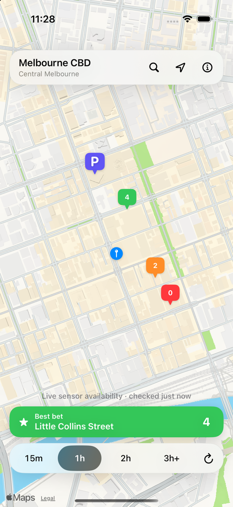
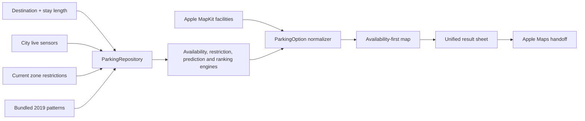

# ParkAlong

<p align="center">
  <strong>One map for Melbourne parking availability, time limits, prices, providers, and directions.</strong>
</p>

<p align="center">
  <a href="https://github.com/OpenRenderKit/ParkAlong/actions/workflows/ci.yml"></a>
  
  
  <a href="LICENSE"></a>
</p>

ParkAlong is a native, map-first iPhone app that brings fragmented parking information into one consistent view. Search a destination across Victoria, choose how long you intend to stay, and compare nearby on-street zones and off-street facilities without jumping between council pages, payment apps, and provider websites.

The normal app flow uses live City of Melbourne sensor data and Apple MapKit. It has no account system, backend, payments, reservations, ads, or runtime AI.

## Screenshots

<p align="center">
  
  
  
  
</p>

## Why ParkAlong?

Parking information is often split across several places:

- council sensor maps show whether bays may be occupied;
- street signs explain how long a driver can stay;
- payment providers handle sessions and current rates;
- commercial operators list separate off-street facilities;
- navigation happens in another app.

ParkAlong normalizes those pieces into a single `ParkingOption` model and a single result sheet. The four primary answers are always the same: **availability, location, time limit, and price/provider**. Arrival prediction is intentionally secondary.

## Features

- Live on-street availability from City of Melbourne parking-bay sensors.
- Green, amber, and red count pins: 3+ spaces, 1–2 spaces, or no currently vacant spaces.
- Statewide parking discovery from 30,890 bundled public records, with explicitly restricted OpenStreetMap parking removed and council records preferred over nearby duplicates.
- Deep-plum `~N` pins for validated predictions and red `P` pins for location-only results; every non-live pin carries a small amber warning.
- Current restriction and price resolution from effective-dated schedules and tariffs when a public source supplies enough information.
- Destination search powered by `MKLocalSearch`.
- Stay-length filtering for 15 minutes, 1 hour, 2 hours, and 3 hours or longer.
- Current time-limit resolution using Melbourne-local day and time.
- Paid/free labelling where the active parking code makes it clear.
- Provider links when a trustworthy reusable price is not available.
- Nearby off-street facilities from MapKit, normalized alongside on-street zones.
- Availability-first Best bet ranking.
- Individual vacant-bay markers fetched only after selecting a zone.
- Apple Maps driving handoff—ParkAlong does not recreate turn-by-turn navigation.
- Two-minute refresh, foreground refresh, manual refresh, and checked-at timestamps.
- Bundled 2019 historical patterns as a clearly labelled fallback when live sensors cannot be trusted.
- Deterministic test fixtures that never leak into a normal launch.
- Light mode, dark mode, Dynamic Type, VoiceOver labels, and reduced-motion support.

## Stay filters

The duration control is a real result filter, not a display preference.

| Selection | ParkAlong shows |
| --- | --- |
| `15m` | Zones that allow at least a 15-minute stay, plus currently unrestricted options |
| `1h` | Zones that allow at least one hour, plus currently unrestricted options |
| `2h` | Zones that allow at least two hours, plus currently unrestricted options |
| `3h` | Zones that allow at least three hours, plus currently unrestricted options |
| `4h` | Zones that allow at least four hours, plus currently unrestricted options |
| `6h` | Zones that allow at least six hours, plus currently unrestricted options |
| `8h` | Zones that allow at least eight hours, plus currently unrestricted options |

Changing duration clears the previous markers immediately and fetches a fresh, matching result set. If no nearby on-street zone fits, ParkAlong says so and keeps useful off-street options visible rather than presenting a network error.

## How it works



### Trust and freshness

Sensor rows are accepted only when they have a recognized occupancy state, usable zone/location data, and a status timestamp within the previous 24 hours. Ambiguous or stale rows are excluded. Static records can answer “where,” “how long,” and sometimes “how much,” but never inherit a live availability colour. Predictions require a known capacity, at least 100 observations, and held-out calibration error no greater than 10%. Under-counting or withholding an estimate is preferred to advertising a questionable vacancy.

### Ranking

Results are ranked deterministically with availability dominating distance:

- 70% predicted available-space count;
- 20% walking distance;
- 10% freshness and confidence.

The map renders the top 24 ranked on-street options to remain responsive while zooming and panning.

### Price and providers

ParkAlong shows `Free` when the current restriction code establishes it. For metered parking and commercial facilities, the app shows a current provider/payment link when it cannot verify a reusable exact tariff. It never invents a price.

## Architecture

The project keeps networking, domain rules, prediction, ranking, and UI orchestration separate:

| Component | Responsibility |
| --- | --- |
| `ParkingAPIClient` | Opendatasoft spatial queries, pagination, response validation, and decoding |
| `ParkingRepository` | Refresh lifecycle, joins, brief cache, live/typical switching, and result construction |
| `AvailabilityEngine` | Sensor trust cutoff and zone-level Present/Unoccupied counts |
| `RestrictionEngine` | Active time window, parking-code parsing, and stay eligibility |
| `PredictionEngine` | Conservative live/history blending and clamping |
| `ParkingRuleResolver` | Melbourne-time restrictions and effective-dated tariff calculation |
| `StaticParkingRepository` | Lazy statewide catalog loading, nearby filtering, source precedence, and prediction gating |
| `RankingEngine` | Pure deterministic availability-first scoring |
| `OffStreetParkingService` | Nearby MapKit facility discovery and provider normalization |
| `LocationService` | When-In-Use authorization and location fallback |
| `DestinationSearchService` | MapKit destination search |
| `ParkingMapViewModel` | Main-actor UI orchestration and refresh race protection |

## Requirements

- macOS with Xcode 16 or newer
- iOS 17+ simulator or device
- [XcodeGen](https://github.com/yonaskolb/XcodeGen)
- Python 3 for data generators and their tests

No paid Apple Developer account is required for simulator use.

## Run locally

```bash
git clone https://github.com/OpenRenderKit/ParkAlong.git
cd ParkAlong
brew install xcodegen
xcodegen generate
open ParkAlong.xcodeproj
```

Or build entirely from the terminal:

```bash
xcodebuild build \
  -project ParkAlong.xcodeproj \
  -scheme ParkAlong \
  -destination 'platform=iOS Simulator,name=iPhone 17 Pro,OS=latest' \
  CODE_SIGNING_ALLOWED=NO
```

Set a simulator location in central Melbourne:

```bash
xcrun simctl location booted set -37.8136,144.9631
```

Location permission is optional. If permission is denied, ParkAlong stays centred on Melbourne CBD and destination search remains fully usable.

## Tests

Run the deterministic app test suite:

```bash
xcodebuild test \
  -project ParkAlong.xcodeproj \
  -scheme ParkAlong \
  -destination 'platform=iOS Simulator,name=iPhone 17 Pro,OS=latest' \
  CODE_SIGNING_ALLOWED=NO
```

Run generator tests:

```bash
python3 -m unittest discover -s Scripts/tests -v
```

Run the separate real-network smoke check:

```bash
python3 Scripts/smoke_live_api.py
```

Audit the anonymous Victorian sources and their actual event freshness:

```bash
python3 Scripts/probe_victoria_sources.py --source all
```

See [the Victorian parking data source audit](docs/victoria-parking-data-sources.md) for tested council, statewide, app, and vendor evidence. Only City of Melbourne is currently classified as verified live occupancy; other sources remain static, stale, unavailable, or rejected until their anonymous responses prove otherwise.

UI tests use `-ui-testing` with deterministic `-fixture-live`, `-fixture-loading`, or `-fixture-error` launch arguments. `-location-denied` covers the CBD fallback and `-intercept-navigation` verifies navigation without leaving the test app. Normal launches never select fixtures.

## Rebuild bundled data

Refresh current zone metadata and sign restrictions:

```bash
python3 Scripts/generate_metadata.py
```

The historical generator streams the 2019 archive directly from its ZIP and does not load 42.7 million rows into memory:

```bash
mkdir -p Scripts/data
curl -fL \
  'https://opendatasoft-s3.s3.amazonaws.com/downloads/archive/7pgd-bdf2.zip' \
  -o Scripts/data/2019-parking-events.zip

python3 Scripts/generate_prediction.py \
  Scripts/data/2019-parking-events.zip \
  ParkAlong/Resources/Generated/historical_availability.json \
  --metadata ParkAlong/Resources/Generated/zone_metadata.json
```

The raw archive is ignored by Git. Only the compact generated artifact is committed.

Rebuild the anonymous statewide static catalog and its manifest:

```bash
python3 Scripts/generate_victoria_static_catalog.py
```

The generator currently combines public council data from Maribyrnong, Ballarat, Casey and Boroondara; official council parking/rate pages for selected named facilities; and OpenStreetMap's statewide parking layer. It records the fetch time and per-source counts, clusters dense bay geometry, and does not convert payment transactions or old occupancy surveys into live availability.

## Data sources and attribution

Live and historical parking data is provided by the City of Melbourne and licensed under [Creative Commons Attribution 4.0](https://creativecommons.org/licenses/by/4.0/):

- [On-street parking bay sensors](https://data.melbourne.vic.gov.au/explore/dataset/on-street-parking-bay-sensors/)
- [Sign plates located in each parking zone](https://data.melbourne.vic.gov.au/explore/dataset/sign-plates-located-in-each-parking-zone/)
- [Parking zones linked to street segments](https://data.melbourne.vic.gov.au/explore/dataset/parking-zones-linked-to-street-segments/)
- [2019 parking events archive](https://opendatasoft-s3.s3.amazonaws.com/downloads/archive/7pgd-bdf2.zip)

Off-street place discovery and destination search use Apple MapKit. Provider availability, opening hours, and prices remain controlled by each provider.

The bundled static catalog retains source-level attribution and source links in every record. It includes council open data under each catalog's published terms and OpenStreetMap data under the [Open Database License](https://www.openstreetmap.org/copyright).

## Privacy

- No account or advertising identifier.
- No first-party analytics or tracking.
- No backend operated by ParkAlong.
- Location is used on-device to centre searches and is not stored by the app.
- Normal app network requests are limited to City of Melbourne data and Apple MapKit/Maps. The statewide static catalog is fetched by a developer-run generator and bundled with the app.

## Source limitations

- Availability changes quickly and is not a reservation.
- Sensors can be unreliable on public holidays, around construction, or when a bay is temporarily unavailable.
- Exact on-street and facility prices are not consistently exposed through reusable public interfaces; ParkAlong shows a number only when an effective public tariff can be resolved for the selected stay.
- Off-street facility results can provide provider links while current capacity remains unknown.
- Historical fallback data describes 2019 patterns and is always labelled as typical, not live.
- Statewide static locations are discovery aids. Posted signs and on-site prices remain authoritative.

## Contributing

Contributions are welcome. Start with [CONTRIBUTING.md](CONTRIBUTING.md), use an issue for user-visible changes, and keep networking/domain behavior covered by deterministic tests. Please read the [Code of Conduct](CODE_OF_CONDUCT.md) and report sensitive problems according to [SECURITY.md](SECURITY.md).

## License

ParkAlong source code is available under the [MIT License](LICENSE). Bundled and remotely fetched City of Melbourne datasets retain their original CC BY 4.0 terms and attribution requirements.
